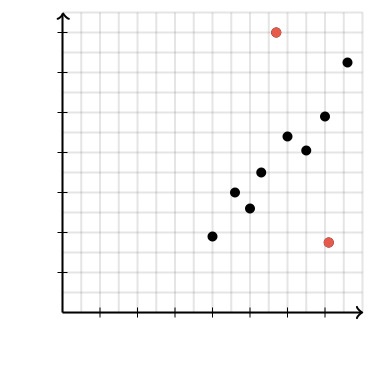
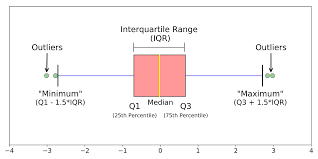
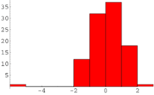
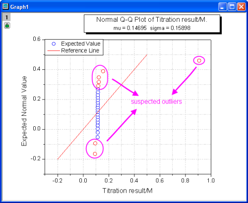

# Handling_Outliers
Outlier Detection and Handling in Data Analysis - A Comprehensive Guide
-------------------------------------------------------------------------------------
# Handling Outliers in Data

## What Are Outliers?

Outliers are data points that significantly differ from the majority of the data in a dataset. These data points are often distant from the central tendency of the data distribution, which can be the mean, median, or mode. In simpler terms, outliers are values that are unusually high or low compared to the rest of the data.

**Key Characteristics of Outliers:**
- **Unusual Values:** Outliers are data points that do not follow the typical pattern or distribution of the data. They are typically located far from the bulk of the data points.
- **Impact:** Outliers can have a disproportionate impact on statistical analyses and machine learning models. They can skew summary statistics (e.g., mean and standard deviation) and distort the results of data analysis.
- **Causes:** Outliers can result from various factors, including errors in data collection or entry, natural variation in the data, or genuinely unusual observations that are of interest in certain applications (e.g., fraud detection).

**Detection:**
Outliers can be identified using statistical methods or visualization techniques. Common methods include the Z-score, the Interquartile Range (IQR), or graphical methods like box plots and scatter plots.

## How to Detect Outliers?

Here, we briefly discuss a few techniques for detecting outliers:

### 1. Visual Inspection:

   - **Scatter Plots:** Create scatter plots for pairs of variables to visually identify data points that appear far from the main cluster.
     

   - **Box Plots:** Box plots provide a visual representation of the data distribution, highlighting any data points beyond the whiskers (outliers).
      

### 2. Summary Statistics:

   - **Z-Score Method:** Calculate the Z-score for each data point, which measures how many standard deviations the data point is away from the mean. Values with high absolute Z-scores (typically greater than 2 or 3) are considered outliers.

#### Explanation of Z-Score Method:
The Z-score method, also known as standard score or z-value, is a statistical technique used to identify and quantify outliers in a dataset. It measures how far a data point is from the mean of the dataset in terms of standard deviations. A Z-score tells you how many standard deviations a particular data point is away from the mean. Here's how you calculate and interpret Z-scores:

The formula for calculating the Z-score for a data point "x" in a dataset with a mean (μ) and standard deviation (σ) is:

Z = (x - μ) / σ

Here's a step-by-step explanation of how to use the Z-score method to detect outliers:

1. Calculate the Mean and Standard Deviation:
   Calculate the mean (average) and standard deviation of your dataset. These are denoted as "μ" (mu) and "σ" (sigma), respectively.

2. Calculate the Z-Score for Each Data Point:
   For each data point in your dataset, calculate its Z-score using the formula above.

3. Set a Threshold:
   Decide on a threshold Z-score value beyond which data points will be considered outliers. A common threshold is Z > 2 or Z < -2, but you can adjust this based on your specific analysis and goals. A higher threshold like Z > 3 or Z < -3 will be more stringent in identifying outliers.

4. Identify Outliers:
   Any data point with a Z-score beyond the chosen threshold is considered an outlier. If Z > threshold or Z < -threshold, the data point is flagged as an outlier.

Interpreting the Z-score:
- If Z = 0, it means the data point is exactly at the mean.
- If Z > 0, the data point is above the mean by Z standard deviations.
- If Z < 0, the data point is below the mean by |Z| standard deviations.

Note: The Z-score method is effective for identifying outliers in normally distributed data or data that approximates a normal distribution. In cases where your data is not normally distributed, other outlier detection methods may be more appropriate. Additionally, Z-scores should be used in conjunction with domain knowledge to make informed decisions about whether to treat outliers or retain them for further analysis.

   - **IQR (Interquartile Range) Method:** Calculate the IQR, which is the difference between the 75th percentile (Q3) and the 25th percentile (Q1). Data points below Q1 - 1.5 * IQR or above Q3 + 1.5 * IQR are considered outliers.
   
#### How IQR Method Works:

Suppose you have a dataset of exam scores:
(15, 30, 42, 50, 55, 58, 60, 75, 80, 120)

Calculate Q1 and Q3 (25th and 75th percentiles):
- Q1 = 42 (25th percentile)
- Q3 = 75 (75th percentile)

Calculate the IQR:
- IQR = Q3 - Q1 = 75 - 42 = 33

Define the bounds:
- Lower Bound = Q1 - 1.5 * IQR = 42 - 1.5 * 33 = 42 - 49.5 = -7.5
- Upper Bound = Q3 + 1.5 * IQR = 75 + 1.5 * 33 = 75 + 49.5 = 124.5

Identify outliers:
- The value 120 is within the range between the lower bound and upper bound (-7.5 ≤ 120 ≤ 124.5), so it is not considered an outlier.

Note: The IQR method is robust to the shape of the distribution and is especially useful when dealing with skewed data or data with non-normal distributions.

### 3. Histograms:

Outliers are often easy to spot in histograms. For example, the point on the far left in the above figure is an outlier.

### 4. Quantile-Quantile (Q-Q) Plots:

A Q-Q plot is a graphic method for testing whether a dataset follows a given distribution, but it may also be used to determine outliers. The expected values are not following the reference line, indicating the data was not normally distributed, and the data points away from the reference lines are suspected outliers.

### 5. Machine Learning-Based Methods:

Some machine learning algorithms can be used to identify outliers. For example, Isolation Forest, One-Class SVM, and Local Outlier Factor (LOF) are algorithms designed for anomaly detection.

## How to Handle Outliers?

### 1. Remove Outliers:

One straightforward approach is to remove the outliers from your dataset. This is suitable when you have strong reasons to believe that the outliers are due to errors or represent extreme, rare cases that you do not want to consider in your analysis.

**Z-Score Method:**
Calculate the Z-score for each data point, and if the Z-score is beyond a certain threshold (e.g., Z > 3 or Z < -3), consider it an outlier and remove it.

**IQR Method:**
Calculate the IQR, then identify outliers as values outside the range [Q1 - 1.5 * IQR, Q3 + 1.5 * IQR].

### 2. Transform Data:

Instead of removing outliers, you can transform the data to make it less sensitive to extreme values. Common transformations include:

**Log Transformation:**
Logarithmic transformation is a data preprocessing technique used to handle outliers and address issues related to data skewness or heteroscedasticity.

#### Heteroscedasticity:
In simpler terms, it means that the spread of the data points around the regression line or the model's predictions varies as you move along the values of the independent variables.

##### How Log Transformation Handles Outliers?

**Compression of Data:** Logarithmic transformation compresses the range of the data. Large values are reduced more than small values. As a result, extreme outliers are "pulled in" closer to the bulk of the data.

**Linearization:** In many cases, log transformation can help make the relationship between variables more linear. Linear relationships are often easier to model and analyze using linear regression or other linear methods.

**Stabilizing Variance:** In cases where the spread of data varies with the magnitude of values (heteroscedasticity), log transformation can stabilize the variance across the data range.

**Normalization:** Log transformation can make the data distribution more symmetric and closer to a normal distribution. This can be beneficial for statistical analyses and modeling techniques that assume normally distributed data.

#### When to Use Log Transformation?

Log transformation is particularly effective when dealing with data that follows a multiplicative or exponential distribution.

**Box-Cox Transformation:**

**How Box-Cox Transformation Works:**

The Box-Cox transformation applies a power transformation to the data, expressed by the formula:

y(λ) = (x^λ - 1) / λ if λ != 0, log(x) if λ = 0

- y(λ): represents the transformed data.
- x: is the original data.
- λ: is a parameter that determines the type and strength of the transformation.

The transformation is applicable to positive values of x.

The choice of λ depends on the characteristics of your data, and it may involve selecting the value of λ that maximizes the normality and homoscedasticity of the data. Common values of λ include:

- λ=0: Logarithmic transformation (natural log).
- λ=0.5: Square root transformation.
- λ=1: No transformation (identity function).
- λ=2: Square transformation.
- λ=−1: Inverse transformation.

**When to Use Box-Cox Transformation?**

You may consider using the Box-Cox transformation in the following situations:

- Non-Normal Data: If your data deviates from a normal distribution and the normality assumption is crucial for statistical tests or modeling techniques (e.g., linear regression), applying the Box-Cox transformation can help make the data more normally distributed.

- Heteroscedasticity: When your data exhibits varying levels of variance (heteroscedasticity) across different levels of an independent variable, the Box-Cox transformation can help stabilize the variance, making it more constant.

- Homogenizing Variances: If you need to ensure that the variances of different groups or conditions are roughly equal, the Box-Cox transformation can be applied to homogenize variances.

- Linear Model Assumptions: When working with linear regression or other linear modeling techniques, meeting the assumptions of constant variance (homoscedasticity) and normality is crucial. The Box-Cox transformation can assist in satisfying these assumptions.

- Improving Interpretability: In some cases, the Box-Cox transformation can improve the interpretability of relationships between variables or make the scale of variables more comparable.

- Handling Non-Constant Variance: When you need to analyze data with non-constant variance (e.g., financial data with changing volatility), the Box-Cox transformation can help make the data more suitable for analysis.

### 3. Winsorization:

Winsorization is a data transformation technique used to handle outliers in a dataset by capping extreme values at a specified threshold.

**How It Works:**
In this method, you set a threshold (e.g., 95th percentile and 5th percentile) and replace values beyond these thresholds with the closest values within the threshold. This approach retains the data points but reduces their impact.

There are two common types of Winsorization:
- Lower Winsorization: Set a lower threshold (e.g., at the 1st or 5th percentile) and replace values below this threshold with the threshold value.
- Upper Winsorization: Set an upper threshold (e.g., at the 99th or 95th percentile) and replace values above this threshold with the threshold value.

**When to use Winsorization?**

- Preserving Data: Winsorization is useful when you want to retain all data points in your dataset, including outliers, but you want to mitigate their impact on your analysis.

- Maintaining Data Integrity: In some cases, removing outliers might not be appropriate because the outliers represent valid and important observations. Winsorization allows you to keep these observations while reducing their influence.

- Robustness in Analysis: If you are concerned that a few extreme values could disproportionately affect your statistical analysis or modeling, Winsorization can make your analysis more robust by limiting the influence of outliers.

### 4. Binning:

**How It Works:**
Divide the data into bins or intervals and replace the outlier values with the bin boundaries or median values within each bin. This can make the data more robust to outliers.

For example, if you have income data with outliers (very high incomes), you can create bins for income ranges (e.g., 0-10,000, 10,001-20,000, etc.) and assign the extreme values to the highest income bin.

Note: it's important to be cautious when using binning for outlier handling because it can lead to information loss and potentially obscure important details about the data distribution. Alternative methods like Winsorization or transformation techniques (e.g., logarithmic transformation) that we had talked about previously may be more appropriate in some cases to mitigate the impact of outliers without discretizing the data.

### 5. Imputation:

**Mean, Median, or Mode Imputation:**
Mean, median, or mode imputation is a straightforward method for handling outliers in a dataset. However, it is not typically the first choice for handling outliers, especially in cases where the presence of outliers significantly impacts the data distribution and statistical analysis. Mean, median, or mode imputation is usually considered when the outliers are either not severe or when you have a compelling reason to use this method.

Here's when you might consider using each of these imputation methods for handling outliers:

**Use Mean Imputation When:**
- Outliers are not extreme and do not significantly affect the mean.
- The variable follows an approximately normal distribution, and the outliers are not due to data entry errors or measurement issues.
- You believe that the mean is a representative value for imputing missing or outlier values.

**Use Median Imputation When:**
- Outliers are present and significantly impact the mean, causing it to be an unreliable measure of central tendency.
- The variable is skewed, and you want to use a more robust central measure that is less affected by extreme values.
- You believe that the median better represents the center of the data, even in the presence of outliers.

**Use Mode Imputation When:**
- You are dealing with categorical or nominal data where the concept of mean or median does not apply.
- Most of the values in the variable belong to one mode, and you want to impute missing or outlier values with the most frequent category.

Note that It's important to exercise caution when using mean, median, or mode imputation for handling outliers, as these methods can distort the data's central tendency and spread, especially in cases of severe outliers. Imputing outliers with central tendency measures may not accurately represent the underlying data distribution and can lead to biased results in statistical analysis or machine learning models.

**Custom Imputation:**
Replace outliers with a specific value or using a more advanced imputation method, such as k-nearest neighbors (KNN) imputation.

**K-Nearest Neighbors (KNN) imputation is a data imputation technique that can be used to handle outliers in a dataset. KNN imputation leverages the values of neighboring data points to estimate or impute missing or outlier values, making it a valuable tool in situations where you want to replace outlier values with more contextually appropriate estimates.**

**Some situations where we could use Custom imputation:**
- Domain-Specific Knowledge: When you have expert knowledge about the data and a strong reason to believe that certain outliers are erroneous or represent data entry errors, custom imputation allows you to replace those outliers with values that make sense within the context of the domain. For example, if you know that a negative value for age is impossible in your dataset, you can replace such outliers with a predefined value.
- Business Rules: In some cases, your organization may have established business rules or constraints that dictate how outliers should be handled. Custom imputation allows you to adhere to these rules while ensuring data consistency.
- Outlier Detection Methods: If you have employed outlier detection methods (e.g., statistical tests or machine learning models like KNN) and identified specific data points as outliers with high confidence, custom imputation can be used to replace these identified outliers based on the results of your analysis.
- Preserving Data Integrity: When you believe that outliers represent valid but extreme observations, and their removal or transformation would lead to a loss of valuable information, custom imputation can be employed to retain the integrity of the data while making the extreme values more manageable.
- Model Interpretability: If you are using imputed data as input to a machine learning model and you want the imputed values to be meaningful and interpretable in the context of the model, custom imputation can help achieve this by assigning values consistent with the model's logic.

**Disclaimer:** Not all information in this repository may be 100% correct. If you have any comments or feedback, please feel free to contact me. I am very grateful for your feedback on my work.

## Future Work:

I am willing to continue working on this repository with the practical implementation of each outlier handling method.

